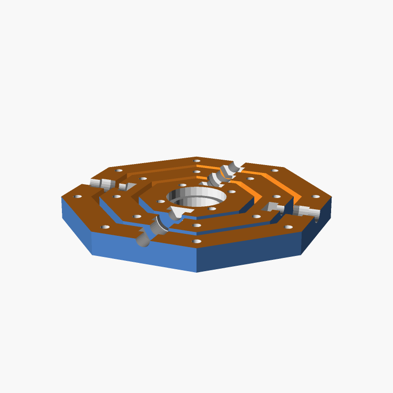
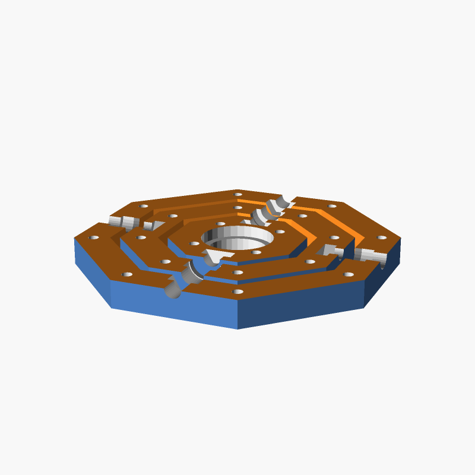
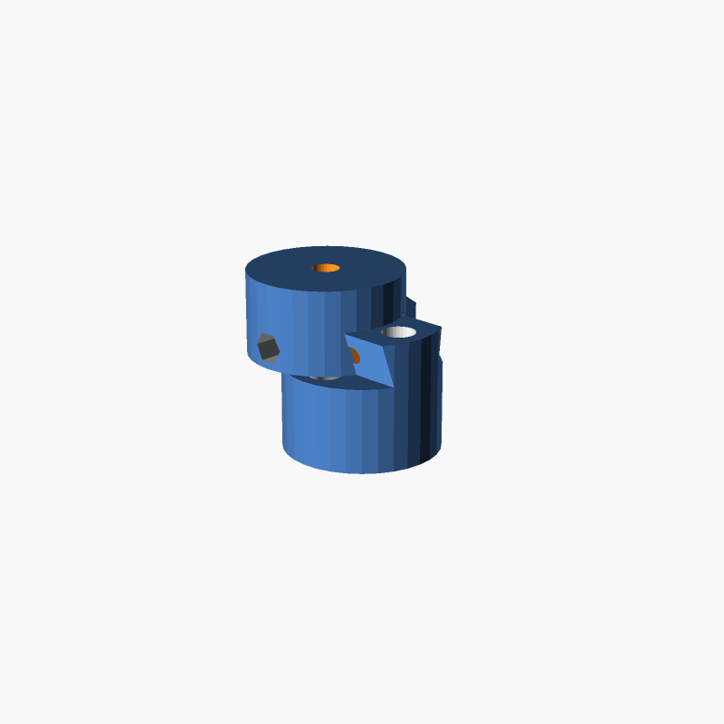

# DSLR gimbal

## Part list

### Screws and nuts
-  4 x Screw M5 16mm DIN-933
- 16 x Screw M3 16mm countersunk bolt (like DIN-9771)
-  4 x M5 self-locking hex nut (like DIN-985)
- 16 x M3 hex nut DIN-934

### Bearings
- 4 x MR105 ZZ (⌀ 10mm ext., ⌀ 5mm int., 4mm height)
- 1 x 608 ZZ (⌀ 22mm ext., ⌀ 8mm int., 7mm height)

|gimbal-lower-half.scad|gimbal-upper-half.scad|handle.scad|
|---|---|---|
||||
|mount.scad|preview.scad|
|||
